1.git configuration commands
1.1 git config --global user.name
syntax:git config --global user.name 
purpose:sets the username that will be associated with all commits on your system
example:git congig --global user.name "gnanasri-221153"
screenshot poof:
1.2 git config --global user.email
syntax:git config --global user.email
purpose:sets the email address associated with your git commits
example:git config --global user.email "n221153@rguktn.ac.in"
screenshot proof: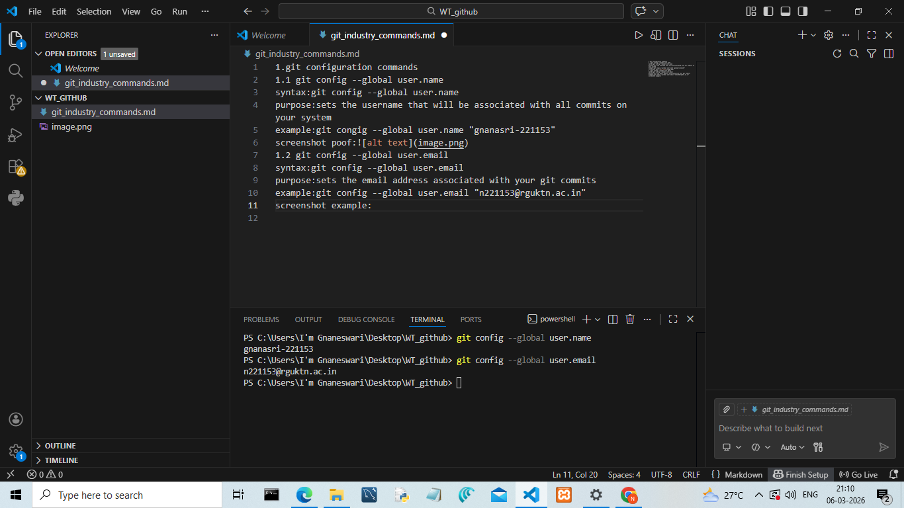
1.3 git config --list
syntax:git config --list
purpose:displays all git configuration settings currently applied
example:git config --list 
screenshot example: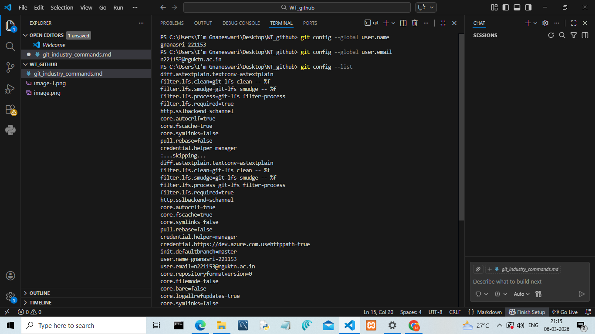
1.4 git config --unset
syntax:git config --unset
purpose:removes  a configuration value from git settings
example:git config --unset user.email
screenshot example:
2.repository setup commands
2.1 git init
syntax:git init
purpose:initializes a new git repository in the current directory
example:git init 
screenshot example: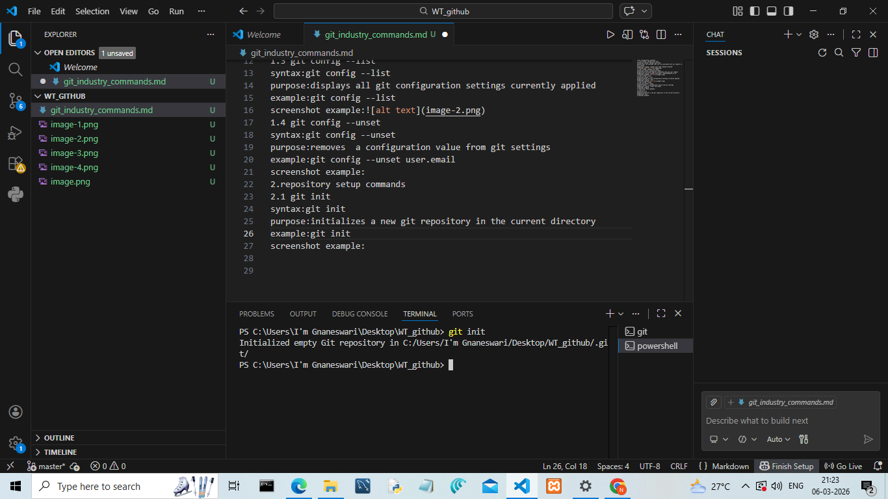
2.2 git clone
syntax:git clone
purpose:creates a copy of an existing github repository on your local machine.
example:git clone https://github.com/gnanasri-221153/php.git
screenshot example:
2.3 git clone branch
syntax:git clone branch
purpose:clones a specific branch from a repository
example:git clone branch main https://github.com/gnanasri-221153/WT-labs.git
scrrenshot proof:
2.4 git clone --depth
syntax:git clone --depth
purpose:Performs a shallow clone, downloading only the latest commits instead of the entire history.
example:git clone --depth 1 https://github.com/gnanasri-221153/wt_phpg
screenshot proof: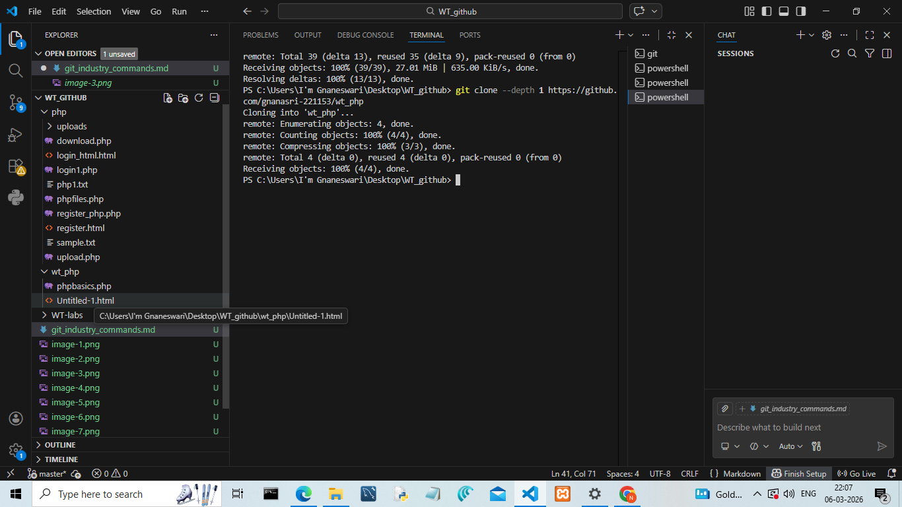
3.repository status and inspection
3.1 git status
syntax:git status
purpose:Shows the current status of files in the working directory.
example:git status
screenshot proof: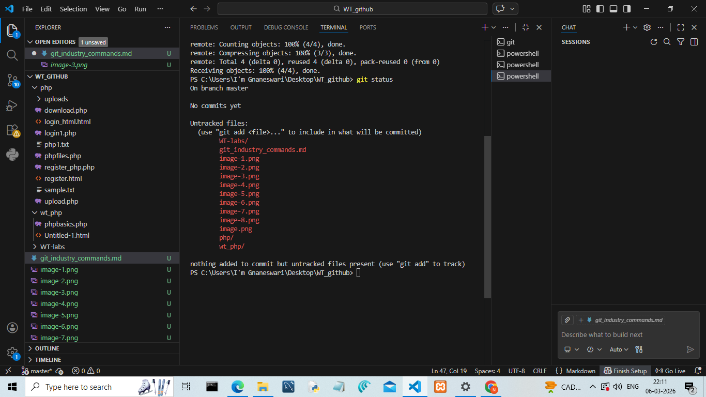
3.2 git log
syntax:git log
purpose:Displays commit history of the repository.
example:git log
screenshot proof:
3.3 git log --oneline
syntax:git log --oneline
purpose:Shows short commit IDs with messages in one line.
example:git log --oneline
screenshot proof:
3.4 git log --graph
syntax:git log --graph
purpose:Displays commit history with a visual graph of branches and merges.
example:git log --graph
screenshot proof: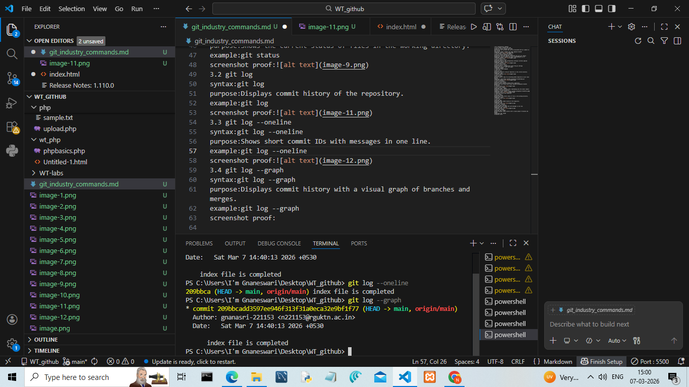
3.5 git show
syntax:git show
purpose:Displays the latest commit details including the commit ID.
example:git show
screenshot proof:
3.6 git diff
syntax:git diff
purpose:git diff shows the difference between the working directory and the last committed version of files.
It highlights added, removed, or modified lines.
example:git diff
screenshot proof:
3.7 git diff --staged
syntax:git diff --staged
purpose:git diff --staged shows the difference between staged changes and the last commit.
It helps developers review changes that are ready to be committed.
example:
screenshot proof:
3.8  git blame
syntax:git blame <file_name>
purpose:git blame shows who last modified each line of a file and in which commit.
It is useful for tracking code changes and debugging.
example:git blame index.html
screenshot proof:
3.9 git reflog
syntax:git reflog
purpose:shows a history of all actions performed in the repository, such as:
commits
resets
checkouts
merges
example:git reflog
screenshot proof: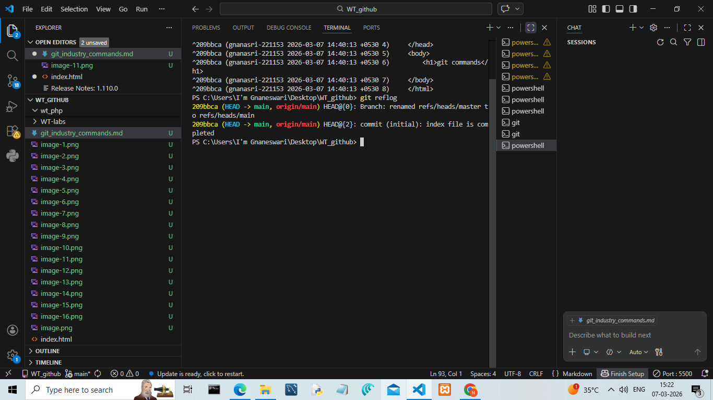
3.10 git shortlog
syntax:git shortlog
purpose:summarizes commit history grouped by author.
It is commonly used to see how many commits each contributor made.
example:git shortlog
screenshot proof:
4.file tracking commands
4.1 git add
syntax:git add <file-name>
purpose:Adds specific file to staging area.
Example:git add index1.html
screenshot proof: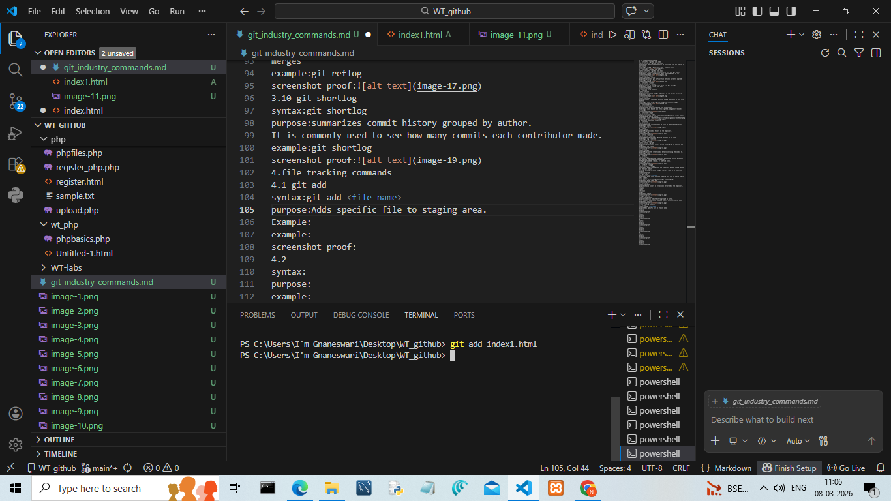
4.2 git add .
syntax:git add .
purpose:Adds all modified files.
example:git add .
screenshot proof: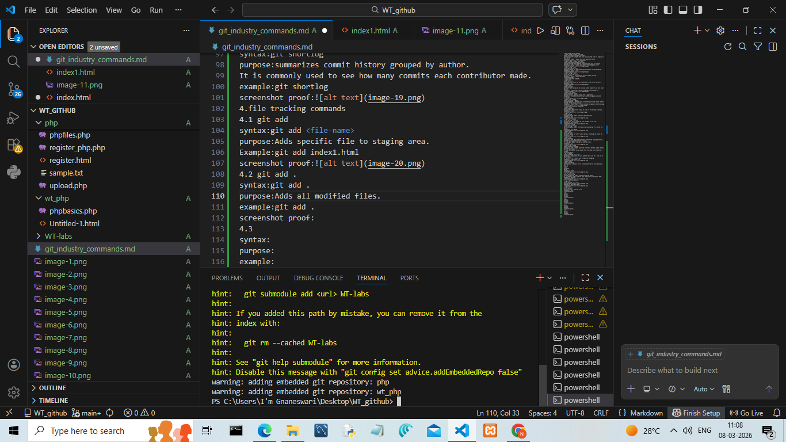
4.3 git add -p
syntax:git add -p
purpose:Adds changes interactively.
example:git add -p
screenshot proof:
4.4 git restore
syntax:git restore
purpose:Restores file to previous state.
example:git restore
screenshot proof:
4.5git restore --staged 
syntax:git restore --staged
purpose:Unstages file.
example:git restore --staged
screenshor proof:
4.6
syntax:
purpose:
example:
screenshot proof:
5.Commit Commands
5.1 git commit
syntax:git commit
purpose:Creates a commit with message editor.
example:git commit
screenshot proof:
5.2 git commit -m
syntax:git commit -m
purpose:Commits with message.
example:git commit -m "initial message"
screenshot proof:
5.3 git commit --amend
syntax:git commit --amend
example:git commit --amend
purpose:Edits last commit
screenshot proof:
5.4 git commit --no-edit
syntax:git commit --no-edit
purpose:Amends commit without changing message.
example:git commit --no-edit
screenshot proof:
6.branch management
6.1 git branch
syntax:git branch
purpose:Lists branches.
example:git branch
screenshot proof: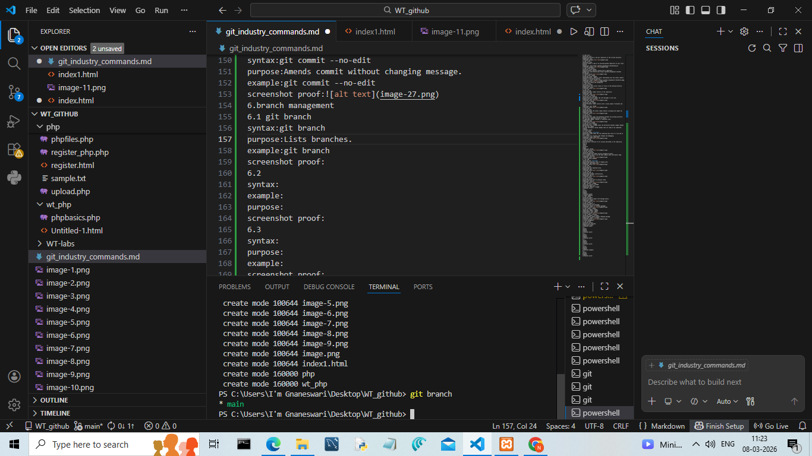
6.2 git branch -a
syntax:git branch -a
example:git branch -a
purpose:Shows all local and remote branches.
screenshot proof: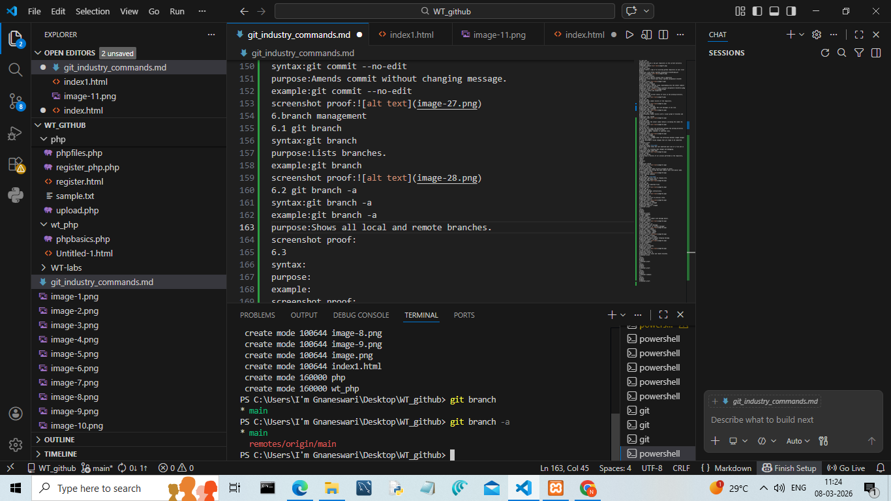
6.3 git branch -d
syntax:git branch -d <branch name>
purpose:Deletes a local branch safely. Git will prevent deletion if the branch has unmerged changes
example:git branch -d feature-login
screenshot proof: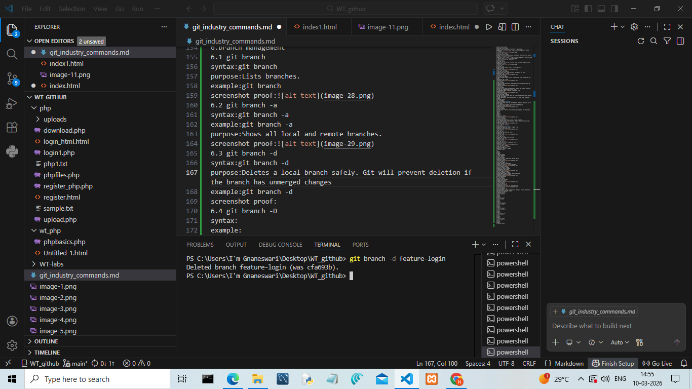
6.4 git branch -D
syntax:git branch -D <branch name>
example:git branch -D feature-login
purpose:Forces deletion of a local branch, even if it contains unmerged changes.
screenshot proof:
6.5 git checkout
syntax:git checkout <branch name>
purpose:Switches from the current branch to another existing branch
example:git checkout feature-login
screenshot proof: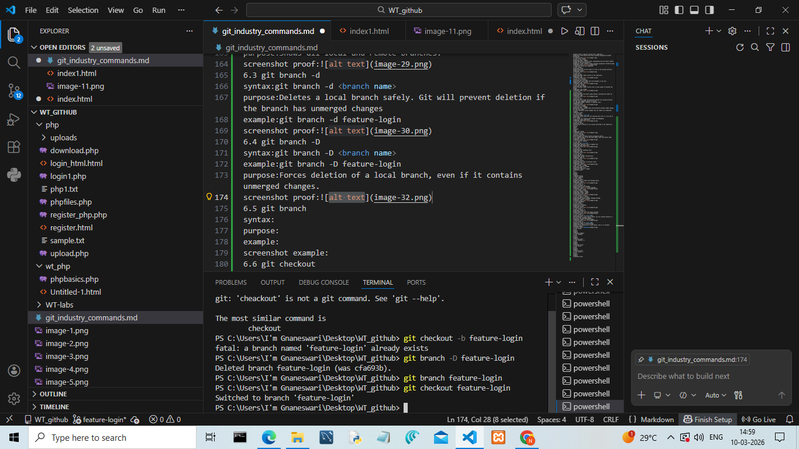
6.6 git checkout -b
syntax:git checkout -b <branch name>
purpose:Creates a new branch and switches to it immediately.
example:git checkout -b feature-login
screeenshot proof: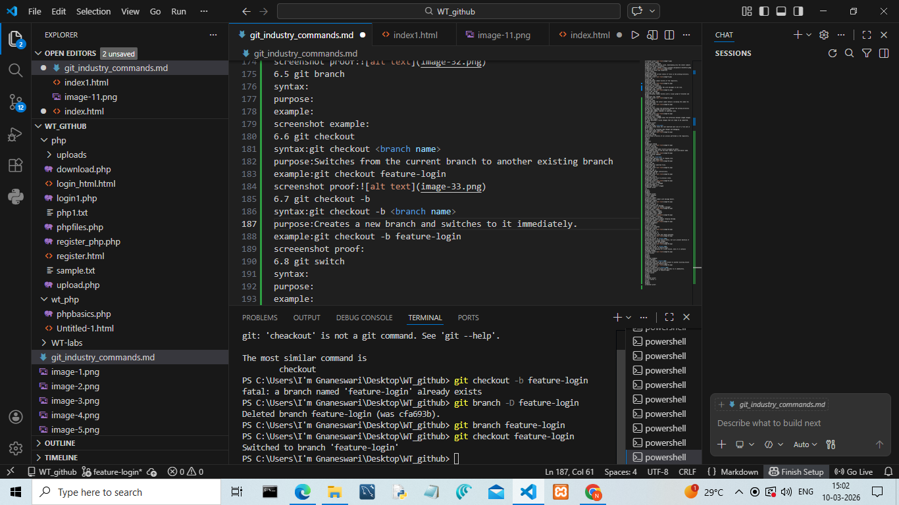
6.7 git switch
syntax:git switch <branch name>
purpose:Switches to another branch. This is a modern alternative to git checkout
example:git switch 
screenshot proof: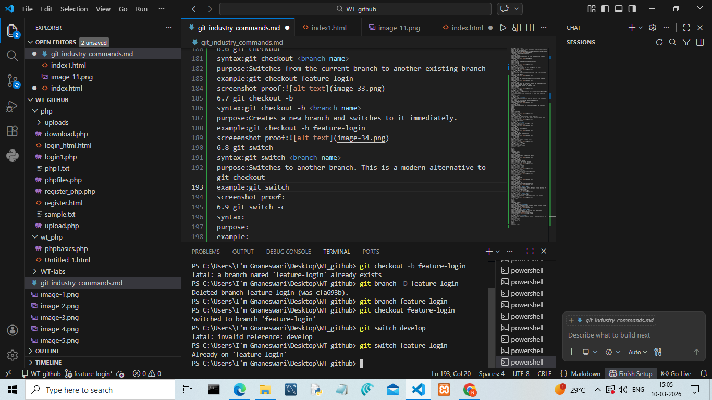
6.8 git switch -c
syntax:git switch -c <new branch name>
purpose:Creates a new branch and switches to it using the newer switch command.
example:git switch -c develop
screenshot proof:
7 merge and integration commands
7.1 git merge
syntax:git merge <branch name>
purpose:git merge is used to combine changes from one branch into another branch. It integrates the commit history of the specified branch into the current branch.
example:git merge feature-login
screenshot proof:
7.2 git merge --no-ff
syntax:git merge --no-ff
purpose:his command performs a merge without fast-forward, meaning Git will always create a separate merge commit even if a fast-forward merge is possible.
This helps preserve the branch history and clearly shows when a feature branch was merged.
example:git merge --no-ff feature-login
screenshot proof: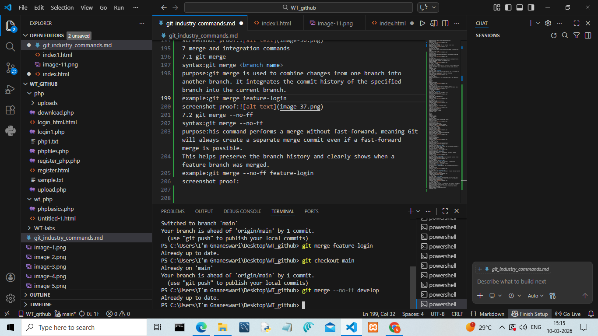
8.
8.1 git remote
syntax:git remote
purpose:Displays the names of remote repositories connected to your local repository.
example:git remote
screenshot proof: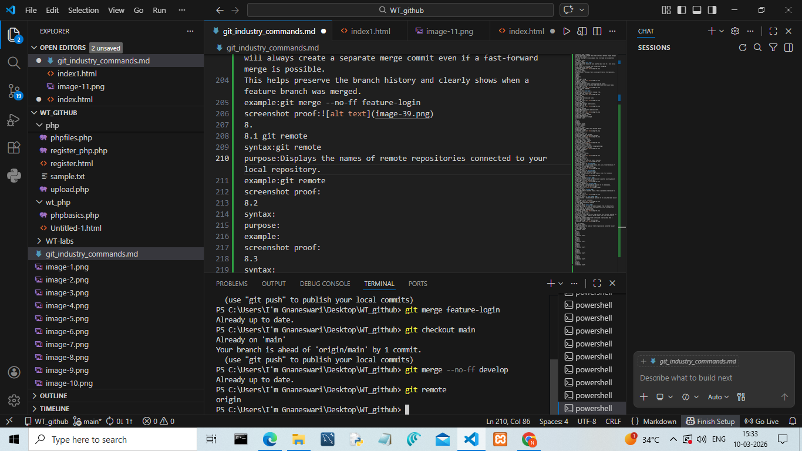
8.2 git remote -v
syntax:git remote -v
purpose:Shows the remote repository URLs for fetching and pushing
example:git remote -v
screenshot proof:
8.3 git remote add
syntax:git remote add
purpose:
eaxmple:git remote add
screenshot proof:
8.4
syntax:
example:
purpose:
screenshot proof:
8.5
syntax:
purpose:
example:
screenshot proof:
8.6 
syntax:
purpose:
example:
screenshot proof:
8.7 
syntax:
purpose:
example:
screenshot proof:
10.reset and undo commands
10.1  git reset
syntax: git reset
purpose:Moves the current branch pointer to a specific commit, optionally changing the staging area and working directory depending on the mode.
example: git reset
screenshot proof: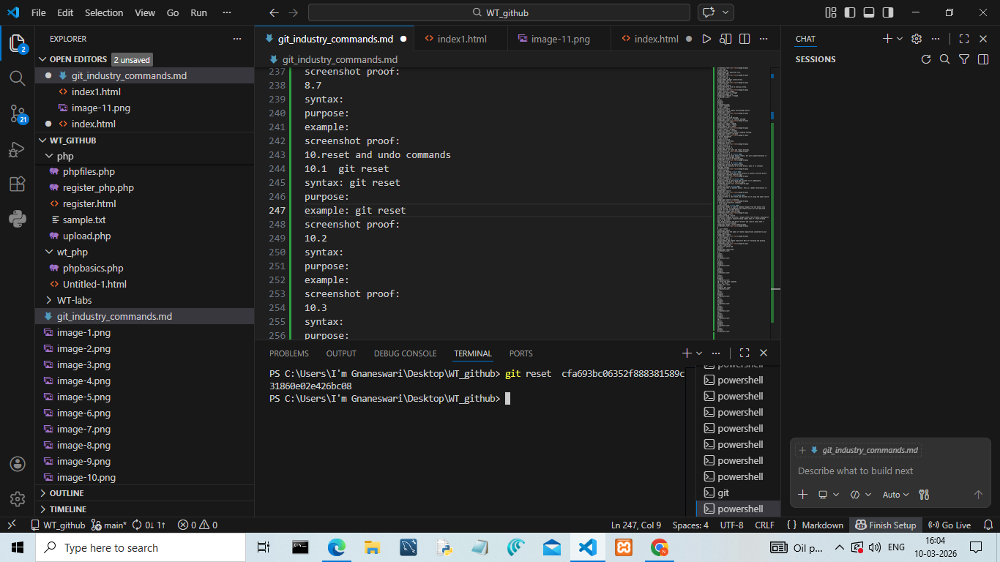
10.2 git reset --soft <commit_id>
syntax:git reset --soft <commit_id>
purpose:Resets the HEAD to the specified commit but keeps all changes in the staging area.
Useful for undoing commits but keeping files ready to commit again.
example:git reset --soft <commit_id>
screenshot proof:
10.3 
syntax:
purpose:
example:
screenshot proof:
10.4
syntax:
purpose:
example:
screenshot proof:
13 tagging commands
13.1 git tag
syntax:git tag
purpose:Lists all tags in the repository.
example:git tag
screenshot proof: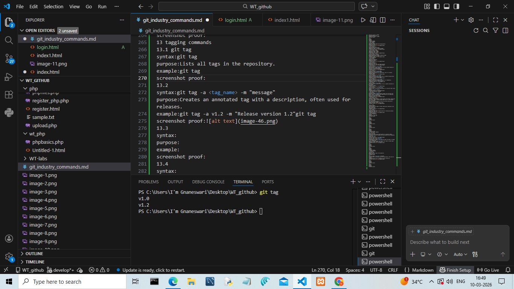
13.2
syntax:git tag -a <tag_name> -m "message"
purpose:Creates an annotated tag with a description, often used for releases.
example:git tag -a v1.2 -m "Release version 1.2"git tag
screenshot proof:
13.3 git tag -d
syntax:git tag -d <tag name>
purpose:Deletes a local tag from the repository.
example:git tag -d
screenshot proof:
13.4 git push origin --tags
syntax:git push origin --tags
purpose:Pushes all local tags to the remote repository on GitHub (or other remotes).
example:git push origin --tags
screenshot proof: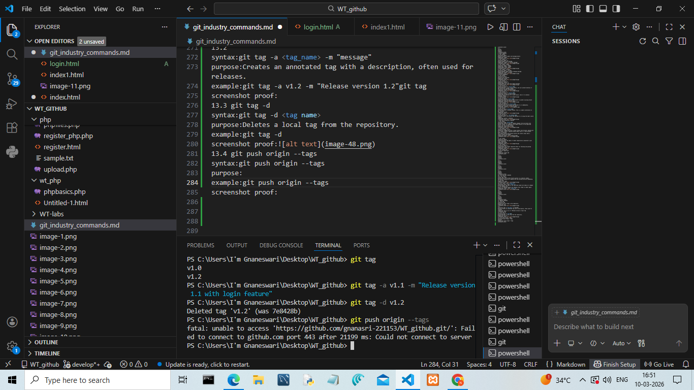
14. Submodule Commands
14.1 git submodule add
syntax: git submodule add
purpose:
example: git submodule add
screenshot proof:
14.2
syntax:
purpose:
example:
screenshot proof:
14.3
syntax:
purpose:
example:
screenshot proof:
15
15.1
syntax:
purpose:
example:
screenshot proof:

